# 2022第四代步兵入门手册

# 一、前言

随着技术交流的取消，2022赛季走向了终点，这一年发生了很多很多事情，疫情的到来让本应充实的2022只剩下了一次区域赛，但也正是区域赛的冲击让我看到了目前步兵电控组所存在的许多不足，无论是人手的不足，还是技术积累的不足，这些都大大的阻碍了我们继续向全国赛前进的步伐。

需要解决的问题有很多很多，首先第一个问题就是，如何让刚进入战队，负责电控的你们在最短的时间内入门？将更多的时间投入到新技术的研发而不是日复一日的修车？鉴于往年战队传承基本都是留下代码以及一份比较散乱的技术文档，新人接受起来比较痛苦以及漫长，需要较多的时间去手把手传授以及学习实践，同时历届资料查询起来杂乱不全面，基本处于一个自己再踩一次以前的坑再进行学习的阶段，学习周期长，新人无法快速接手兵种，故而留下此文档，来归纳总结我们在步兵组这一年一步一步踩坑和学习总结下来的经验，我会更多的从你们的角度出发，去让你们更容易的全面认识步兵，没有枯燥的文字，也没有枯燥的知识，简单易懂，相信不管你接手的是什么兵种，甚至你是算法组或机械组运营组，你们都能够从中学到知识得到科普。

**本文从三个方面来进行叙述，路线为**

**基础篇（硬件）-\>中级篇（认识代码框架）-\>高级篇（认识各种算法）-\>进阶篇（未来方向）**

# 二、基础篇

## （一）步兵有什么种类？

1.  步兵有很多种类，分别为麦轮步兵、舵轮步兵、平衡步兵、全向轮步兵，目前战队已研发出前三种步兵，其中舵轮步兵和平衡步兵为2022年新研发出的兵种，麦轮步兵则技术较为成熟。麦轮步兵从2018赛季开始经历过数次更新迭代，第四代麦轮步兵则是在2021赛季的麦轮步兵的基础上进行改良的。
2.  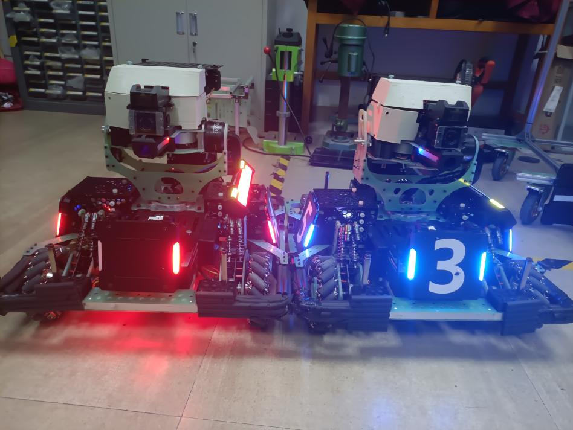
3.  1.1麦轮步兵
4.  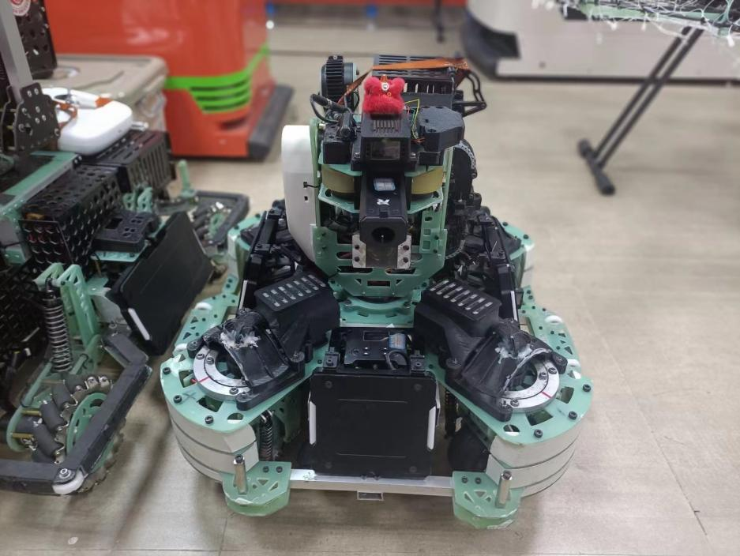
5.  1.2舵轮步兵
6.  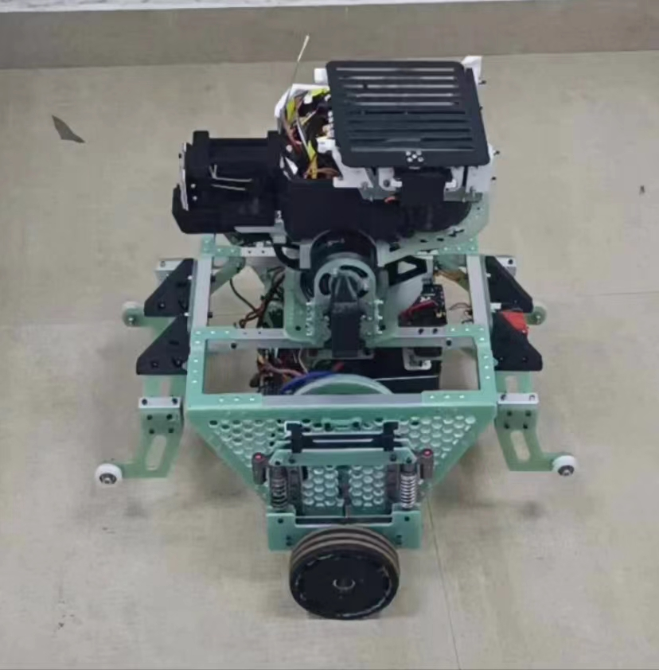
7.  1.3平衡步兵

## （二）步兵身上有什么东西？

### 1、底盘机构

#### （1）电源

1.  **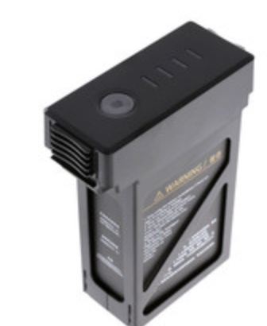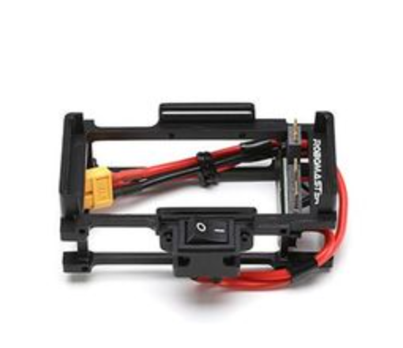**
2.  2.1.1电池和电池架
3.  电源使用的是大疆官方的电池24V，没什么电的时候会掉到22V左右，充电冲很慢也可以达到27V，原理就是电池，没什么好讲的，配套电池架引出一条电源线。唯一要知道的就是，电池会有一些保护措施，但依旧是要保护好，不要甩，同时刚用完的电池拿去充电可能会过热充不进去，闪奇怪位置的灯，这一点要注意。还有就是无人机对电池的要求很高，其他兵种不能拿贴着无人机标志的电池去用，不然无人机可能会炸机。

#### （2）轮子

1.  **3508电机**
2.  **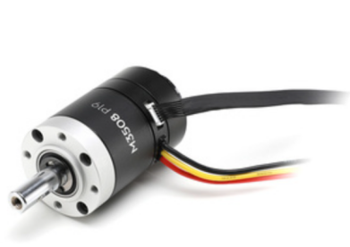**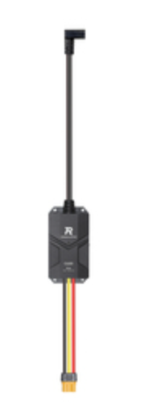
3.  
4.  2.1.2 3508电机和C620电调
5.  这是一个使用很广泛的电机，就跟马达差不多，不过一般马达是两根线，这个电机是三根线的，同时还多了一根线用来读取电机的转速，温度这些数据。右边就是它的电调，相当于驱动器，把两边的线都插上去就好了。原理的话，就是用电流去驱动，把它想象成陀螺模型的话好理解很多，电流就像抽陀螺的鞭子，一抽一抽的，电机就转起来了，这个概念对于功率算法非常重要。（资料会配套发送给你们）

#### （3）小电脑

1.  **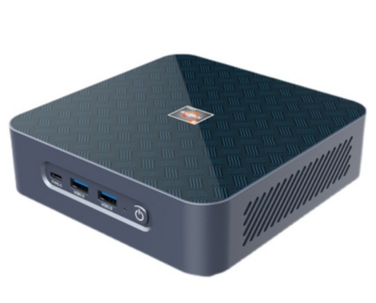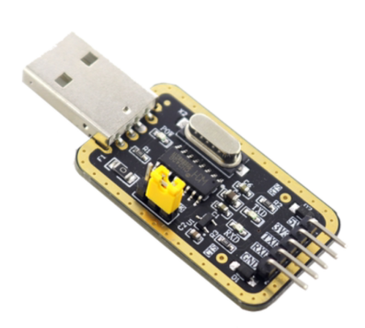**
2.  **2.1.3 小电脑和TTL**
3.  小电脑的话就是小型电脑，能够装在步兵上面，由算法组的同学负责，我们要做的就是给它供下电，把数据传给它，它进行运算后把数据发回来给我们，然后就没有然后了，这就是自瞄的基本原理。
4.  传数据用的是TTL，也就是右边那个东西，我们一般叫做串口，USB那端插在小电脑上面，另一头四个脚，板上写了四个值，分别是5V,3V,RX,TX（这些数值对应主板上面的串口，目前不用了解太多），我们拿一条串口线把它跟主板连接就好了。

### 2、云台机构（步兵的头）

#### （1）Yaw轴和Pit轴电机

1.  **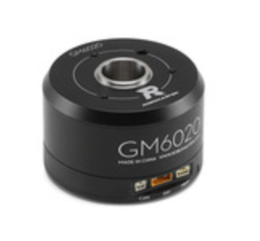**
2.  2.2.1 6020电机
3.  Yaw和Pit的概念，你的头上下摇的平面叫做Pit轴，左右摇则是Yaw轴，把它对应到步兵的头上就知道是什么了，这个电机就是让它的头能上下左右转的。
4.  原理跟3508差不多的，不过这个没有电调，因为已经集成在电机内部了，我们要做的就是给他插一条电源线和一条数据线（CAN线）
5.  

#### （2）陀螺仪

1.  **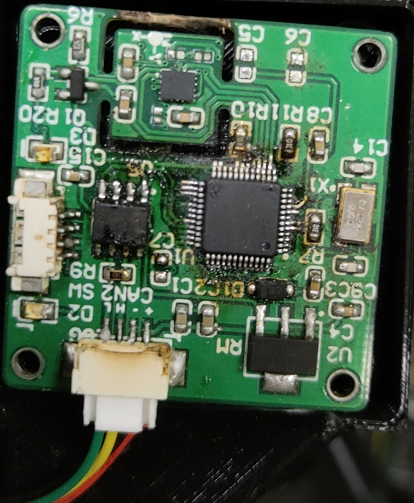**
2.  2.2.2 陀螺仪
3.  这东西也是一块单片机，但目前你不用了解太多，你只需要知道我们要插一根线上去，然后它会传他的数据给我们，比如你的头向左偏转了45°，向上偏转了55°这种数据。我们把他贴在云台上面，这样就能知道云台现在的角度。
4.  这是一种外置陀螺仪，还有一种内置在主板上面的陀螺仪。

#### （3）摄像头

1.  **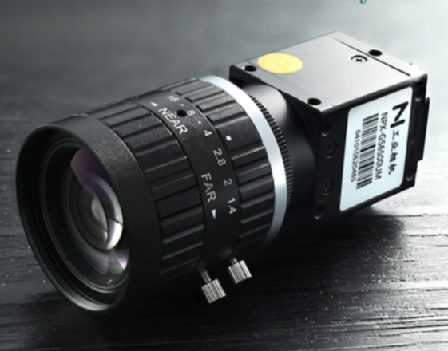**
2.  2.2.3 工业相机
3.  这个是算法组小电脑要用的相机，我们只需要知道这个东西要用一条数据线把它和小电脑连接在一起就可以了。

### 3、发射机构

#### （1）拨盘

1.  **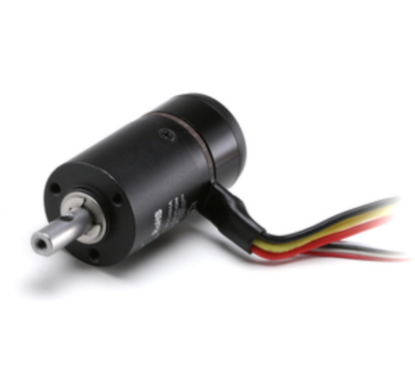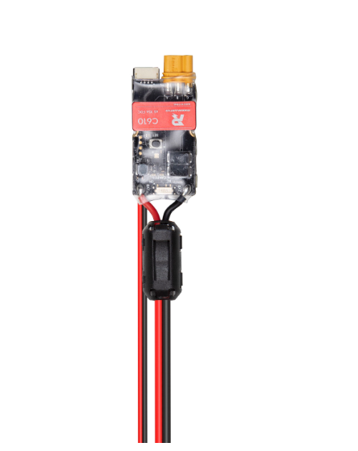**
2.  2.3.1 2006电机和C610电调
3.  跟3508差不多的，只是更小一点，装在拨盘上面，一次转一个角度，然后把弹丸发射出去就是它的使命，同样是一根电源线和一根数据线（CAN线）。

#### （2）摩擦轮

1.  **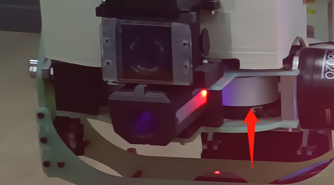**
2.  2.3.2 摩擦轮
3.  摩擦轮就是3508电机拆掉上半身后套了一层类似橡胶的东西（增加摩擦），两个摩擦轮转动挤压把弹丸发射出去。

### 4、其他

#### （1）舵机

1.  **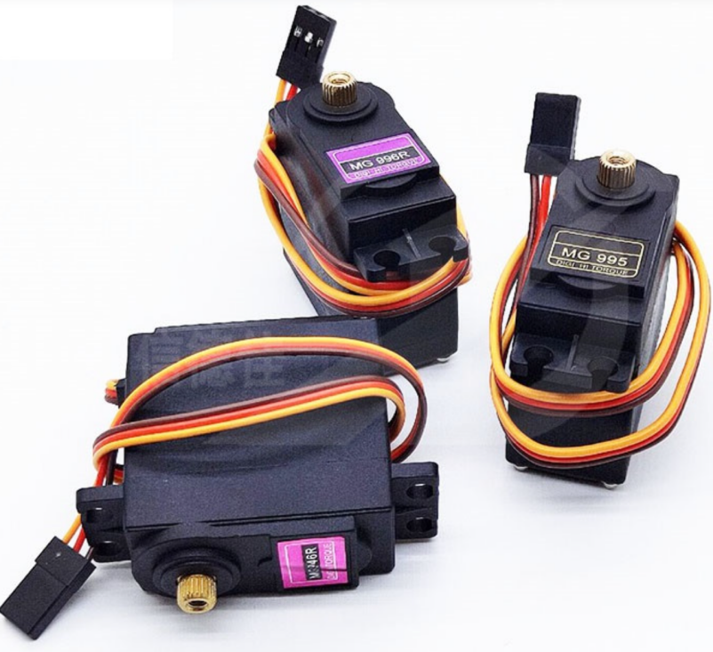**
2.  2.4.1 舵机
3.  这东西有三条线，一条电源，一条地，一条是用来接收数据的，简单点来说原理就是，接收到50°它就转到50°，一般用在弹仓盖上面。

#### （2）分电板

1.  **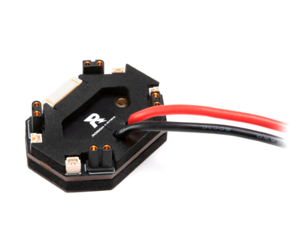**
2.  2.4.2 分电板
3.  分电板就是把电源和数据分成好几路的板子（跟电源排插差不多），用来把整个系统连接起来，这个是官方卖的分电板，我们实验室自己也有做分电板。

#### （3）降压模块

1.  **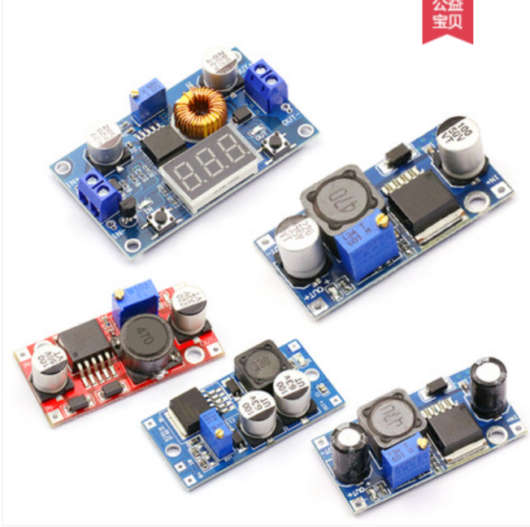**
2.  2.4.3 降压模块
3.  这个东西的存在是为了防止烧东西，比如小电脑要求输入21V，但电池会输出24V，而且还会波动，直接插上去的话可能就把电脑烧了，所以来个中继模块把24V稳定在一个我们想要的值，一般模块上面有个旋钮可以调节。

### 5、裁判系统

1.  裁判系统的东西有很多，裁判系统是用来限制机器人的，打个比方，官方让我们的机器人射出的弹丸只能是15m/s，如果我们超射速了就扣血了，而且是超射速越多扣的越多，这些规则会出现在规则手册里面，后面你们会慢慢接触到，现在你只需要知道这些东西叫什么名字以及怎么给机器人装裁判系统。
2.  **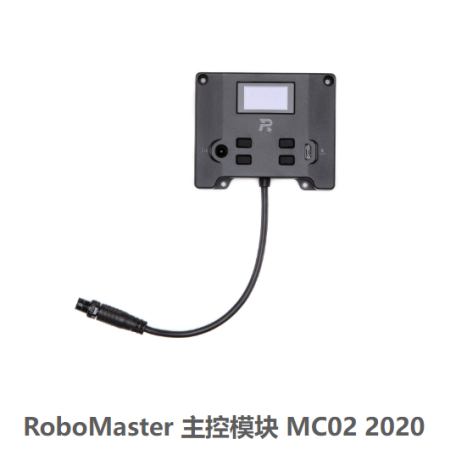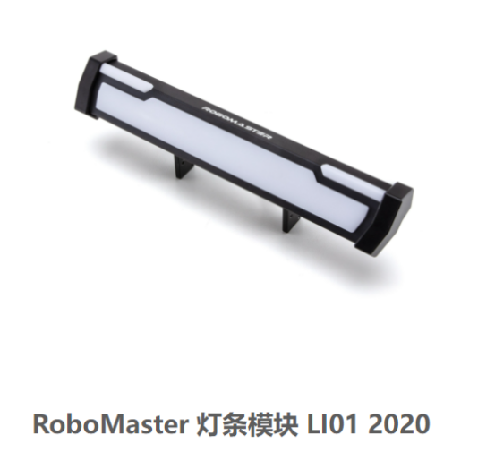**
3.  **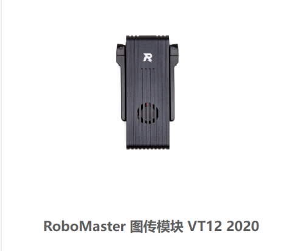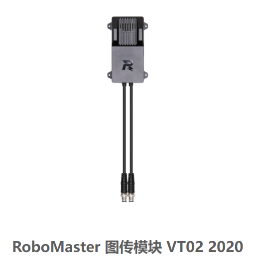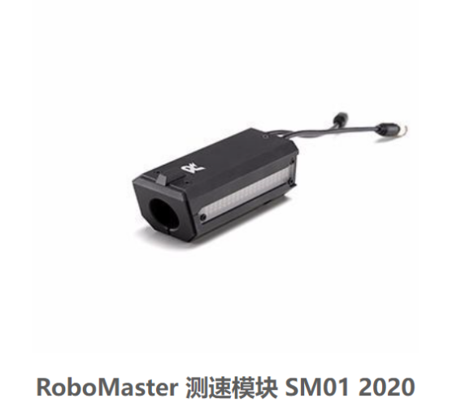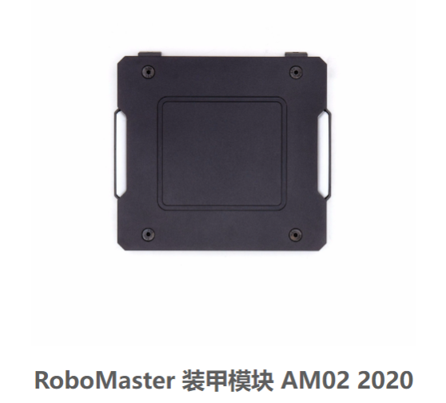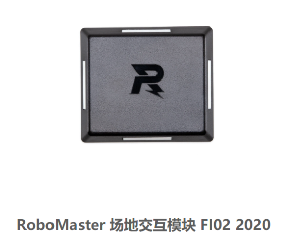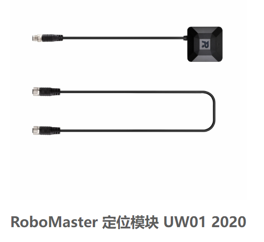**
4.  以上八样东西，基本上有手就能装的，无脑在机械给的位置装上去就可以了，电控基本不用操心。
5.  比较难的是下面这两样
6.  **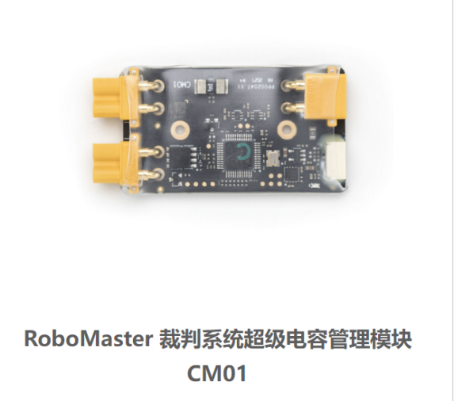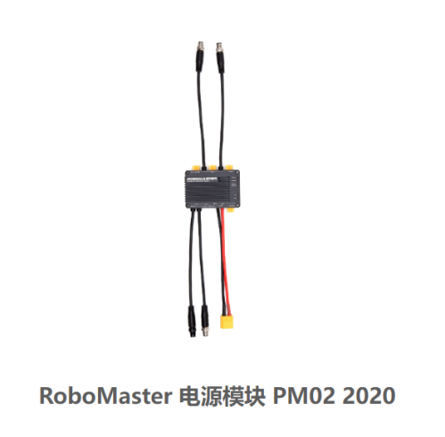**
7.  **左边的是要接在超级电容的电路上的，只有两个口要接，其实也不难。**
8.  **难的是右边的电源管理，接口比较多，需要看说明书，然后把对应的口接上去就好了，其实也没什么难度。**
9.  **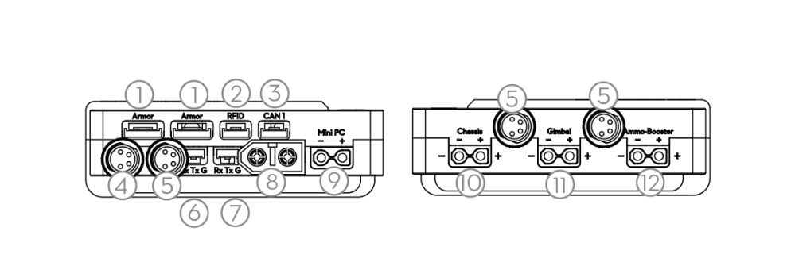**
10. **①Amor接装甲板**
11. **（①和②一个出一个进形成回路）**
12. **（串联防止一块装甲板坏了全都不亮）**
13. **②RFID接场地交互**
14. **③CAN1接超级电容的数据线**
15. **④接主控的航空线(黑色的)**
16. **⑤接枪管、灯条、定位、图传这些（没有顺序要求，一样是串联起来）**
17. **⑥接主板上面的串口（长得跟⑦一样，不要认错了）**
18. **⑦一般用不到，先不用理**
19. **⑧电池的供电线插这里**
20. **⑨小电脑的供电口**
21. **⑩⑪⑫Chassis底盘、Gimbal云台、Ammo-Booter发射机构的供电口**

### 6、主板

1.  **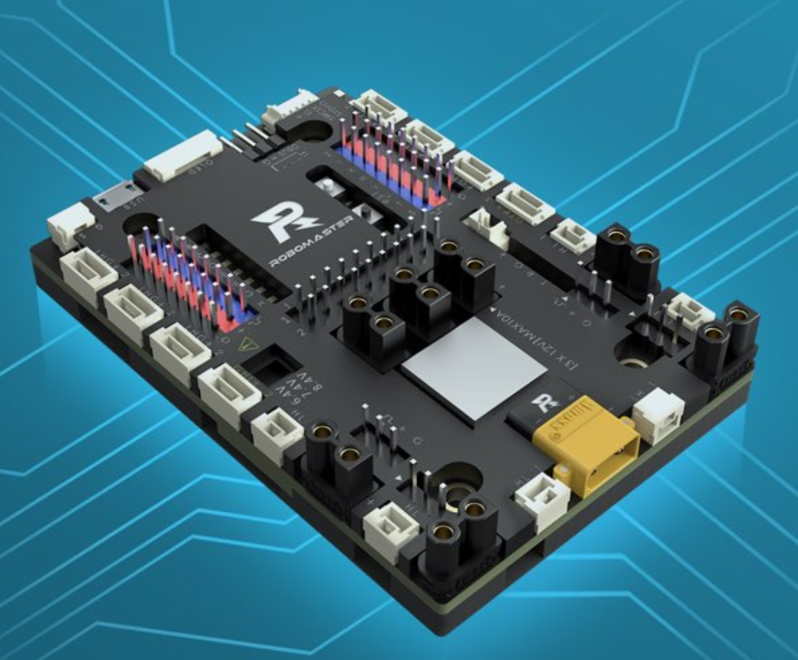**
2.  2.2.6 STM32F427IITx
3.  这块板就是整个机器人的大脑，我们把上面数据线（CAN线），串口线，舵机的数据线，裁判系统的数据线等等线都插上去然后就可以了。板的详细数据，需要去官网查资料，看一看原理图以及有一些单片机基础就能看懂了。
4.  
5.  **以上基本就是拼装一辆步兵所需要的配件了，机械把车做出来之后就由我们电控去把这些东西组装起来，把每一根线连接好。**
6.  

## （三）步兵是怎么拼装组合起来的？

### 第零步：定义颜色含义

1.  
2.  **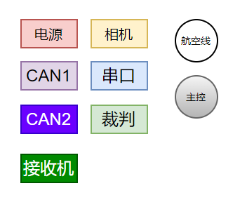**
3.  **电源：**供电
4.  **相机：**相机线
5.  **CAN1，CAN2：**
6.  给班里每个人一个绰号，比如有四个人，我们给他们绰号分别叫小明，小红，小军，小丽，他们在同一个班，班主任只需要叫小明，小明听到后就可以和班主任交流，但有例外，比如不能有同名的绰号，比如有两个人叫小明，这样会造成混乱，还有就是一个班不能有太多人，不然声音太多了，他们就听不清了。因而我们再开一个班，这样就可以容纳更多的人，而且一班可以有一个小明，二班也可以有一个小明，他们不会互相干扰。
7.  班级就相当于CAN总线，CAN1是一班，CAN2是二班，绰号就是我们给设备的命名，让他们在传输时可以唯一性的交流，班主任就是主板。
8.  （详细CAN总线知识可以去B站学习相关知识）
9.  **串口：**用来连接串口线的
10. **裁判：**连接裁判系统的一些比较杂的端口
11. **接收机：**就主板和遥控的接收机连接
12. **航空线：**裁判系统连接模块的线
13. **主控：**也是航空线，不过是黑色的航空线，专门给主控用的，因此特意标注出来

### 第一步：完成底盘控制板的连线

1.  **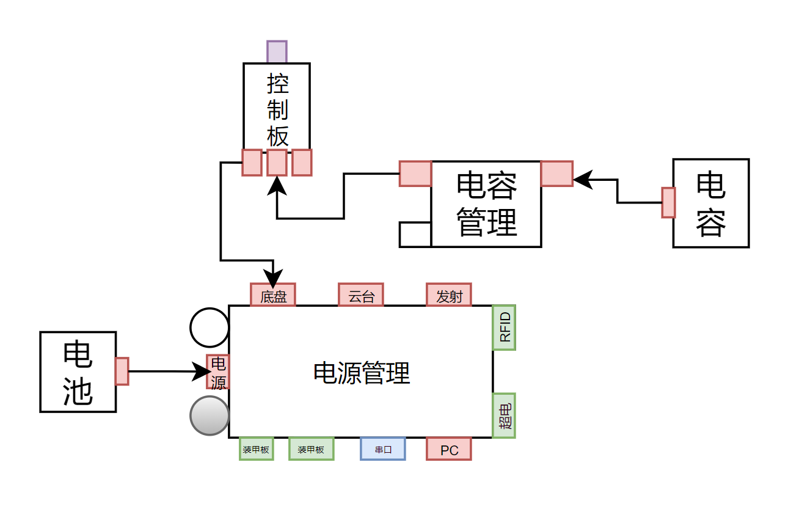**

### 第二步：将电机CAN和电源和小电脑的电源连接

1.  **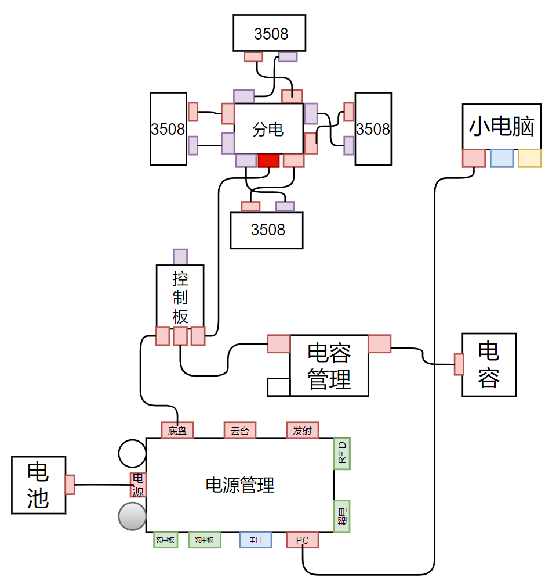**

### 第三步：云台CAN1和CAN2分别布线连接

1.  **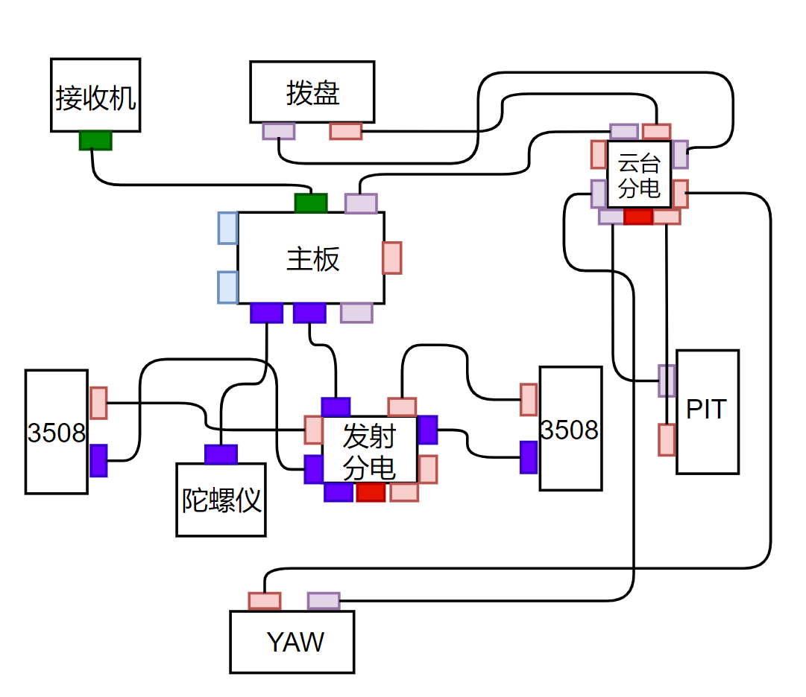**

### 第四步：将云台和底盘，裁判系统连接

1.  **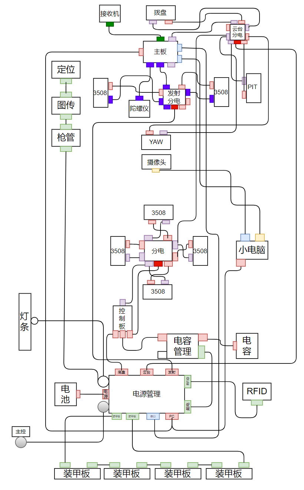**
2.  **这是大体的框架，还有一些其他配件没有在图中显示，比如弹仓盖的舵机和降压模块等。**

## （四）怎么照顾好步兵宝宝？

### 需要准备东西

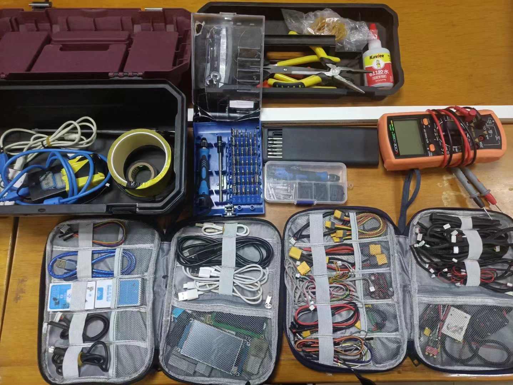

这里面总共有四类是经常要用到的，

①烧录器（烧代码必备）；

②内六角，斜嘴钳等机械工具；（机械组也有，不过电控备着方便一点）

③线材（can线，电源线等）；

④万用表；

### 如何维护

#### 线材层面的维护

线材层面的维护是最多的，由于机器人身上有线，同时机器人运动过程中伴随着大量的抖动，这也就导致我们的机器人的线不可避免的会松动，这也就造成可能会出现轮子不动，摩擦轮不动等各种各样的原因。这也就要求我们对机器人的整理硬件结构有一个非常明确的认识，才能让我们一眼看出机器人出了什么样的问题，因此前面的硬件框架图将会是非常有用的工具，在脑海中有这样的一个图，修起车来就能得心应手，而为了最大程度的减少机器人出现线材层面的问题，那就得从根源解决这个问题，那就是一开始的布线，布线过程中对所有的接口进行稳固的连接，轧带进行固定，接口用热熔胶进行固定，将会很大程度的减少机器人出现故障的次数。

机器人出现故障，排除刚修改了代码导致的bug之外，基本都是线材连接出现了问题，无非就是数据线哪里断了，电源线哪里松了，甚至是一些线材老化了不导通了这些问题。而你们要做的就是排查哪里出现了问题。

举个例子，如果电机不转了首先检测电机有没有亮，如果没亮那就是电源线松了，或则坏了，如果有亮就可以通过烧录器，尝试是否能读取电机发送的信息，如果读不到，那就可以判断是数据线出了问题，进行更换或者维修便可以解决问题。通过万用表可以检测线材是否导通。（万用表打到这个挡位，然后表笔接在线的两头就可以测试线是否导通）

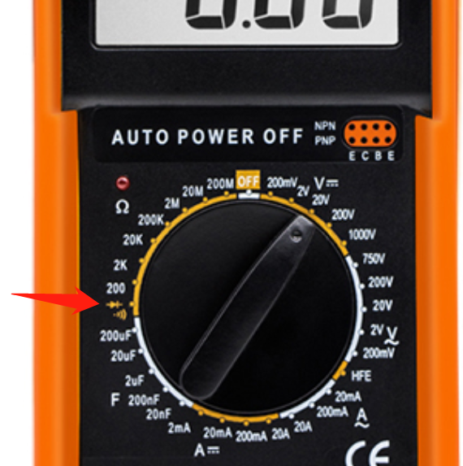

正所谓实践出真知，让你们最快入门的一个办法，那就是让你们把整辆车拆掉，从零开始进行布线，这将是对你们一个非常大的提升，同时能节省大量的后续学习时间。

**注意！！！随手可得的线绝对绝对要测试一下再拿去用，不然基本都是别人用坏放在那的！！！！切记，血的教训！**

#### 代码层面的维护

代码层面的维护一般出现在由于机械结构改变造成的代码不适用，例如两个摩擦轮以1000转/s的速度旋转，射出的弹丸可以是15m/s，但由于撞击导致枪管发生形变，射出的弹丸速度变低了，这时我们就要通过代码改变参数来提高摩擦轮的转速，使其射出15m/s的弹丸满足比赛需求。

不过目前代码正在不断的往自适应的方向进行迭代，也就是通过代码可以避免因为机械结构导致的问题，来解决频繁改动浪费时间的问题，这些你们在后面的高级篇会慢慢的学习到。

# 三、中级篇

首先介绍一个常用的快捷键，Ctrl+F，这个快捷键可以用来在这份繁杂的代码中快速定位对应的变量或者函数，可以极大的提高查找效率，那样就不用翻来翻去的找了，而且还有替换功能，好好利用这个快捷键。

## 这堆看起来头疼的代码是什么？

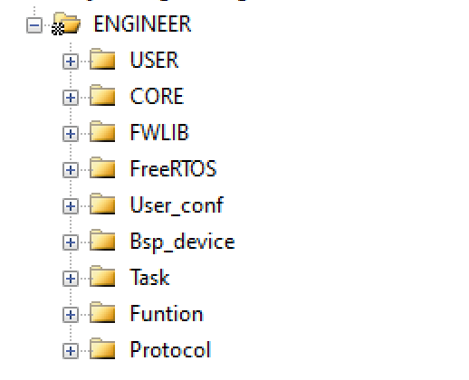

接下来我来一一的为你们介绍代码框架，介绍每一个文件的作用。

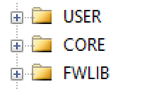

首先是前三个文件夹，这三个你们学过单片机基础的话应该知道是啥了，就不讲了。

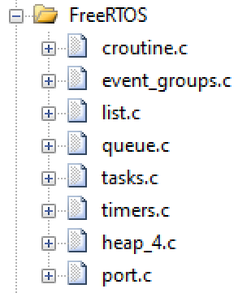

这些是操作系统的内核文件，文件的话基本上也接触不到。

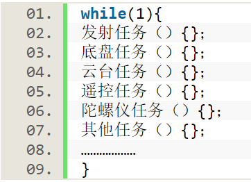

操作系统是什么？很简单，就是一个对各种功能函数进行分配运行的系统，就相当于C语言的这个结构，你们应该能够初步认识操作系统的工作原理。

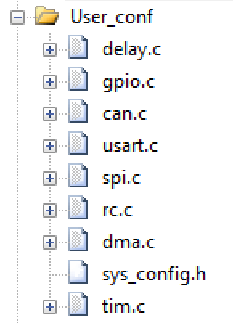

这些你们应该也懂，就不赘述了，不过有一个比较重要，sys_config.h这个文件

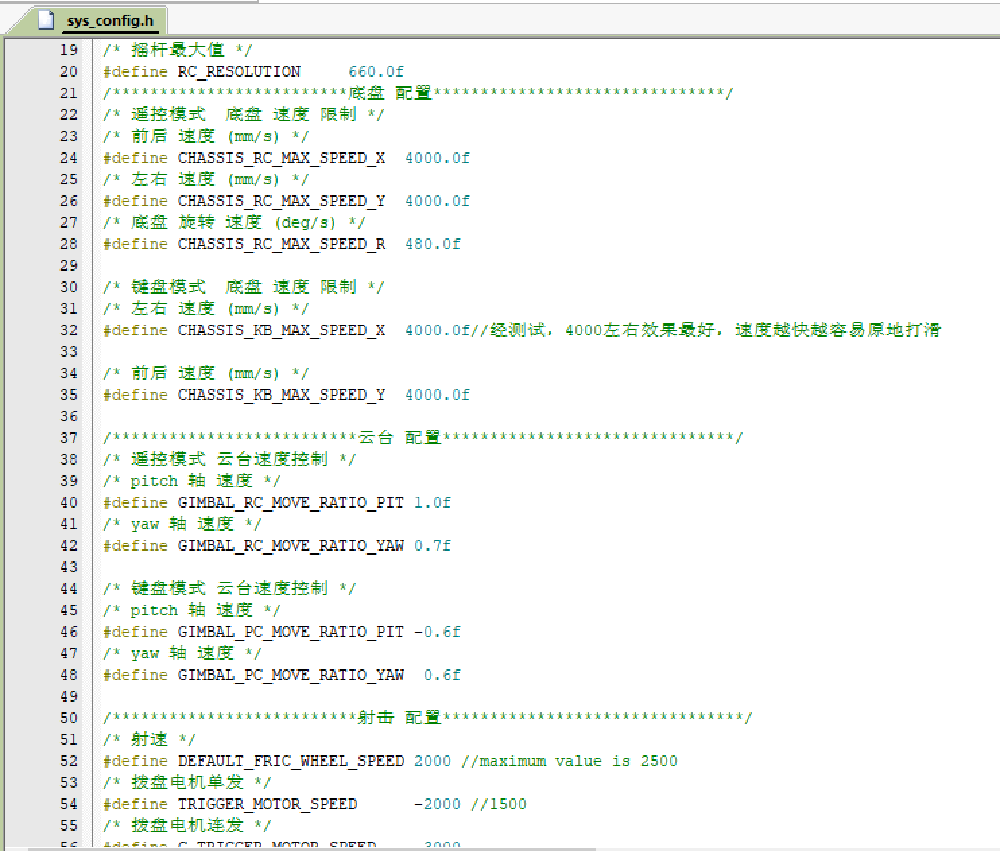

这个头文件存放着宏定义的文件，比如说轮子的最大转速的多少啊，等等一些宏观数值，汇总存放在这里，调用的时候直接引用这个头文件就不会找不到了。

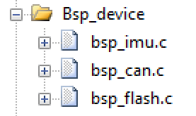

接着是这三个文件，第一个是陀螺仪的配置文件，第二个是CAN通信的配置文件，第三个是flash的配置文件。CAN比较重要，后面会详细讲一下这个文件，flash的话主要用在把数据存在内存中，这样即使是断电了也能保存数据，后面会再讲。

**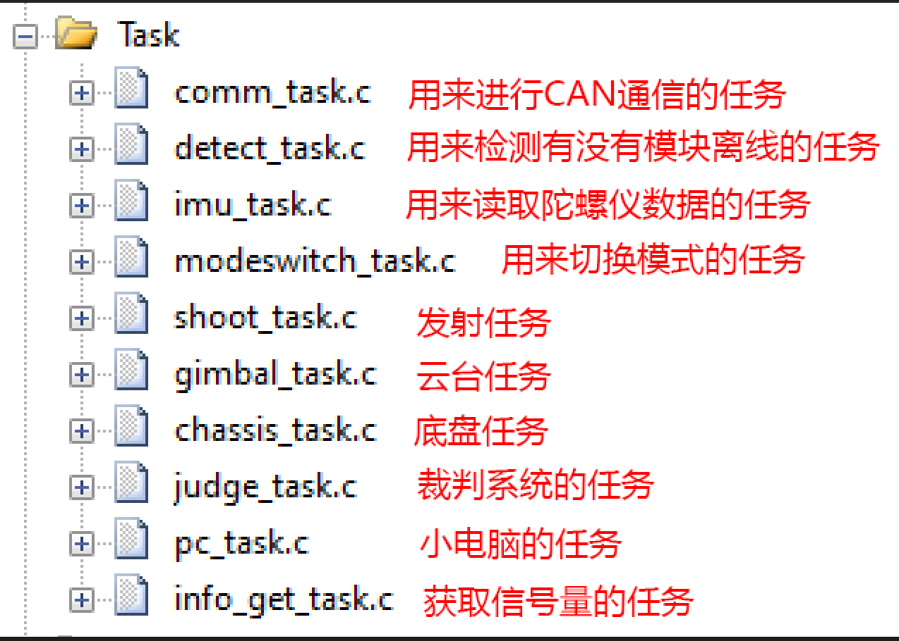**

到这里的话就是各种操作系统的任务了，在操作系统中循环运行，这部分就是整个机器人的核心内容。

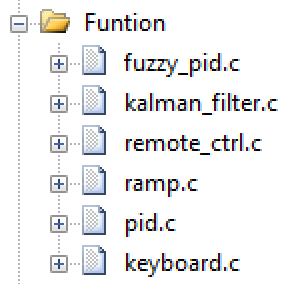

这部分就是一些函数的集合了， 里面有两个是经常要用到的，一个是remote遥控，一个是keyboard键盘，后面会细讲。

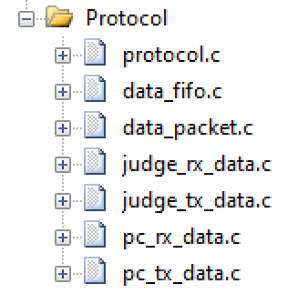

最后一个文件夹，里面是各种文件协议，比较重要的是后面四个文件，分别是裁判系统的收发协议，小电脑的收发协议，具体的后面会再讲。

## 他们是怎么运行的？

### 操作系统

前面说过，操作系统其实就类似于C语言的while(1){}函数，然后在里面加上各种函数（即任务）

只不过上面这个结构的功能太简单了，操作系统是对上面这个结构的复杂化，加入了优先级，延时等很多东西，把很多功能都封装起来了，称为操作系统，其实本质上就是上面这个结构，你们要学的就是如何自己配置一个任务加进去，会比普通的在while里面直接加要复杂一点，下面我来演示一下怎么在操作系统中加入自己写的任务

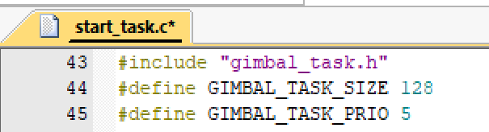首先创建一个你想创建的任务的头文件，比如我创建一个云台的任务，找到这个文件，然后引入头文件进来，接着是设置栈的大小和优先级，这个你看一下其任务是怎么设置的，对照着写一个就好了，栈大小一般都是128，优先级1最高，你根据自己的任务来给一个优先级就好了，优先级越高就排在越前面，相当于while循环里面排第几个函数，优先级5相当于排第五个。

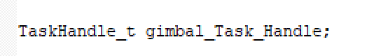

接着是定义一个变量，用来调用操作系统的一些结构体；

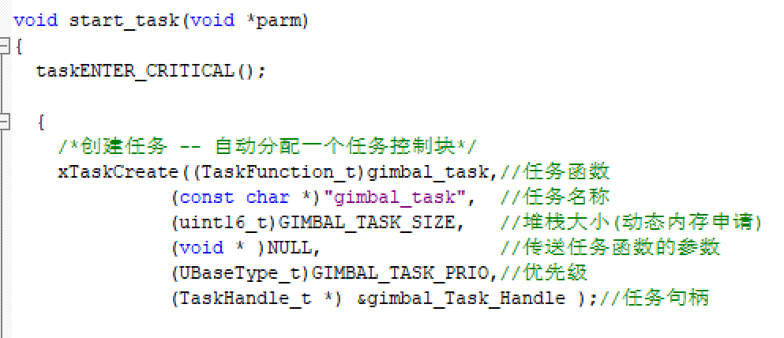

然后就是照葫芦画瓢，照这里填在这个函数里面就好了，这样就在操作系统中创建了一个任务，接着就是写一个.c文件，然后把.h引入就好。


然后在.c文件中搞个这个函数就可以写你的函数内容进去了，while（1）里面的内容是用来进行判定的，具体的内容你们可以去深入学习一下操作系统的内容，对这些东西会更熟悉一点，不过目前你们会自己创建一个函数放到操作系统里面就足够了。

### 陀螺仪

陀螺仪分为两种，一种是板载陀螺仪，一种是外置陀螺仪，板载陀螺仪的意思是A板上面有一个内置的陀螺仪，我们可以通过配置调用然后读取数据，不过由于精度问题，我们选择了外置陀螺仪，即自己做一个精度高一点的陀螺仪然后通过CAN传递到A板上面，本质上就是另一块小单片机，然后把他上面的陀螺仪数据共享给A板。


以上就是CAN对传递过来的数据进行解算的代码，由于解算都在外置陀螺仪上面进行了，所以这部分会比较简单，不过未来可以把板载陀螺仪也用上，然后与外置陀螺仪混合，相互解算，保证稳定性，这样就不怕外置陀螺仪线断了之类的导致机器人无法获取陀螺仪数据。

内置陀螺仪的代码在这两个文件，可以自行查阅。

### CAN

CAN是什么，前面也简单提到过了，就是用来传递信息的通道，但由于一条通道不能同时有太多人进行同时通信，会导致信息干扰，因而还有再分出来一条通道，分别为CAN1和CAN2()


就跟前面说的一样，通道中进行数据传输需要有一个ID来确认身份，因而给每一个元件定义一个ID，从上图可知，我们把底盘、云台和超级电容放在了CAN1,而发射机构和陀螺仪则放在了CAN2，需要注意的是，3508和6020，2006的ID是由限制的，不能自定义，可以通过查找官方的电调使用手册来确定ID，以下用3508来做例子


比如你要给一个电机设置ID，首先当然是在电调上面设置ID，怎么设置的看手册，然后看这个通信协议，首先当然要给一个ID头（标识符），这个ID头相当于数组的头地址，然后跟在后面的数据就是对应电机的数据。


这四个就是标识符，当然这是只有发送才需要这个标识符的，如果你只需要接收数据就不需要标识符，例如陀螺仪的ID，没有标识符。3508的一个标识符后面只能跟8字节，一个ID占用两个字节，因此一个标识符只能带动四个电机，而总共有两个标识符可以用，不过需要注意，不同电调的标识符可以通用，因而一个标识符实际上可以挂不同的电机（不过不推荐，有点乱）标识符可以通过查阅手册来获取。


上面这个就是用来发送数据的函数模板了，其他函数跟这个也差不多的，其实就是为了发一个数组而已，没有很复杂。因为只能发送八字节，每个ID是两字节，一字节是八比特，因而一个ID有16比特可以用，int_16刚好是16比特，因而要把一个数据分成两段来发送，因而有了上面的位操作把一个数据分成两段（也就是说精度不高，没办法发送高精度的数据，但你可以把八字节全部用来传输一个数据，这样就有64比特了，这样才能传输高精度数据，比如陀螺仪一般要传送浮点型的数据）


有发送当然就有接收，我们要用CAN来接收电机发送过来的数据，比如转速，温度，还有陀螺仪的数据等，就在这个函数体里面定义，你们学习过CAN通信的话这部分应该就不难理解了，看起来复杂是因为传递过来的数据很多，我们要把他们逐个解算出来，然后对应到结构体里面


比如这个，解算编码值的，会比较复杂，不过最下面两行就不难理解，就是进行位操作然后把数据还原出来，编码值是因为发过来的值我们需要二次解算所以看起来很麻烦。

CAN通信的内容基本就那么多，无非就是在头文件中设置ID，然后在.c里面设置发送和接收，照葫芦画瓢实践几次就熟练了。

### 4、FLASH


flash的内容不多，目前涉及到用来给云台校准。


通过按键来实现把云台的编码值写入flash


下次开机后主板直接读取编码值。当然flash还可以用来做很多其他的事情，比如定期把一些日志存进flash中，这样出bug了可以直接读取日志来实现快速找bug。

### 5、"remote_ctrl"


这个文件里面的这个函数，就是接收遥控发过来的数据，然后我们解算成对应的前后左右，当然还有左右两边的拨杆，以及拨轮。


具体的解算可以查阅官方遥控的使用手册


头文件里面定义了不同模式的触发条件，我们也可以手动定义（英雄和步兵的遥控控制是不一样的，所以这里的宏定义也不一样）


这部分的话是鼠标的解算，这里涉及到一个滤波

链接：https://pan.baidu.com/s/1aK05r5-6271Q6y2ZaEwEdA?pwd=kkec

提取码：kkec

（具体可以打开查看）

其他的基本也都是对遥控发来的值进行处理，同理。

### 6、“keyboard”


键盘这部分基本是跟遥控一样的，键盘的值也要通过遥控发送，不过由于按键只有触发和不触发两种状态，因此不需要进行解算可以在结构体中直接调用。


鼠标则还需要进行一些判定，来判断是长按还是单击，这部分关系到后面的发射模式，是单发还是连发，有时候单击一次射出多发可能就是这里的问题，可能是识别成了连发，不过也有可能是机械结构的问题。


还有这里，这是一个切换云台方向的一个判定，当鼠标滚轮（rc.mouse.z是滚轮）触发了换头，则一些标志位被激发，在其他函数体中进行处理。变量i用来限制触发的频率，防止触发频率过快。

### 7、"info_get_task"


这个文件是用来进行数据的传递的，相当于数据的中转站，把鼠标键盘遥控的值和CAN通信传递来的值对应到各自的结构体。


这里的话就对应前面鼠标标志位的触发，触发换头后将云台yaw轴的编码值加180°，不过由于编码值不是度数表示的，具体的实现会复杂一点。

其他的基本也都是信息量的传递和给定，可以到对应文件中详细看看。

### 8、“comm_task”


这个文件很重要，是对所有CAN发送函数体的集合地，所有电机解算后的数据都在这里通过CAN通讯发往对应的电机。

### 9、"detect_task"


这个文件是对电机等各种CAN通讯模块以及其他任务进行离线检测的，err_id结构体可以看到各个任务模块的实时运行时间，一旦任务没有阻塞在允许的延时内即运行正常，对应的结构体就会变为0。

### 10、"modeswitch_task"


这个结构体就是用来进行模式切换的，检测遥控键盘的值是否触发特定值，然后进行模式切换

切换前要先判定电机是否正常通信，才能进行模式的切换


然后就是各种模式切换的判定。

### 11、"judge_task"

这部分主要关注的是如何画UI，不过这部分由于经历了很多大改小改，变得比较的混乱，活生生的屎山代码，建议以后不要再堆这座屎山了，挖掉重新整理一下，下面简单讲述以下如何创建UI。


首先再裁判系统任务里面创建，以5为一个标志位创建，然后i置零进入下一个循环，如果要创建新的UI图层，就再弄一个新的标志位，如下。


接下来就是最屎山的地方了，由于需要顾及到刷新率的问题，还有各种逻辑判断，一开始的架构没有做好，导致很多地方有点乱，总之，画UI要先创建一个静态层，然后等静态层全部创建完就可以进行动态层的刷新。


这里可以看到，Line_mask就是静态层，由于需要刷新至少5次才能显示在UI上面，所以还需要给个标志位来判断每一层是否刷新了五次。


这里是第四层的UI，需要动态刷新的UI需要经历一次静态部署，都在图层四进行。


若要进行UI创建，就继续写下去，写在i==21里面，然后照葫芦画瓢填写函数。


接着就是对动态层进行刷新，（静态层只需要部署一次，动态层要一直循环部署刷新）


然后就来到这里了，这里跟前面的静态刷新是一个道理的，需要每个图层刷新5次才能正在显示在UI上面，因此多出了一大坨的标志位和判定条件，不过原理都是原因的，只是还想不到简化的办法。


这里就是对更新的内容的部署了，还记得前面定义的新的图层5吗？你只需要在这里在延续下去，if(text_twist == 5){},然后照葫芦画瓢就可以了。当然这里只说了大体的流程，具体的一些照葫芦画瓢的内容要对照着其他函数是怎么写的，然后再到相应的函数体里面去部署，实践实践就大概知道怎么搞了，不过还是不推荐这套体系结构，太复杂了，后续还需要推翻重写优化一下。


这个是目前最新的UI界面，下面的进度条可以用来实时显示电容量，中间偏右的三个值分别是总的电容值和当前的电容值以及视觉有效位，左上角则是各种模式和楷开关右上角则是速度和小陀螺转速，以及云台的一些角度信息。

### 12、"pc_rx_data"


接下来是与小电脑的通讯部分，首先是接收小电脑发送过来的数据，全部解算后存放在这个结构体里面。


这个则是发送给小电脑的数据。


这些值就是发送给小电脑的，和算法联调就需要看这两个结构体，要看我们发送过去的值正不正常，以及看算法组发回来的值正不正常，时常有正负号的问题要注意。

说了那么多，前面的都是铺垫，接下来就是三巨头，首先来看一下整体的运行逻辑图。


### 13、"shoot_task"


首先是这个地方，由于我们的代码是很多辆车共用一份的，由于机械结构无法做到完全一样，因而各种参数有微小的变化，因而做了几个宏定义来区分哪台车用哪个变量定义。


修改的地方在之前的宏定义那里，烧代码的时候记得注意改号码，对应上去，否则会有问题的。


这部分就是发射任务的内核了，其实就是根据规则，不同等级给不同的转速来射出符合速度规则的弹丸。同时加上了遥控和鼠标进行单发连发控制的函数。


这三个函数就是后面注释的相应内容。


判断摩擦轮有没有转，转的话进入单发和多发的函数处理。


这里就是判断单发和多发的函数了，由于状态很多，也是引用了很多的标志位，所以看起来有点繁琐，Angle变量是用来定义拨盘电机每次转多少角度的，比如现在的拨盘，转一次45°就可以发射一发弹丸，如果以后拨盘改了，这里可以相应的改成对应的角度。


由于拨盘和算法的一些问题，导致拨盘无法以45°进行固定的转动，因而加入了这个函数体进行限制，在拨盘电机固定45°进行一次旋转而不会受其他因素的影响。但依旧有一个弊端，那就是开机时电机无法对自身进行定位，因而会在拨盘上面做一个定位的标记，然后开机前手动把拨盘转到那里校准再上电开机。

总结下来，发射任务其实就是根据裁判系统的规则来进行射速的给定，但规则还有热量的问题，这个涉及到pid算法，后面会再细讲。

### 14、"gimbal_task"

云台任务，涉及到两种模式，一种是手动模式，也就是用鼠标和遥控控制云台上下左右，一种是自瞄模式，小电脑把我们传递给他的值解算出来，然后发给我们，云台转到对应的角度就可以实现自瞄。


首先是对不同模式的初始化，这里是对PID参数的初始化，可以先不用知道为什么，后面会细讲PID。


接下来就是判断当前的模式进入对应的函数体中。


切换模式首先要进行一些值的重新给定以及标志位的变化，不然会疯头（例如正常模式下云台静止时用的是电机编码位来定位运动时用陀螺仪定位，而小陀螺时全都是用陀螺仪来进行定位，两种模式切换时要给定不同的值）其中offset是补偿值，由于编码位和陀螺仪数据转换会很不一样，陀螺仪转圈圈时会360°，720°的叠加，而编码位则是180°后就突变到-180°，两者转换起来会很麻烦。


首先是判断是否有换头，有的话就对一些标志位进行变化。


运动时用陀螺仪进行过定位，静止一段时间后就改用电机编码位进行定位。

原因：编码位进行定位比较精确，但由于机械和pid算法的问题，四个轮子不可能做到一样的速度，因而若用编码位会导致走不直。而陀螺仪的话则会好一点，但由于陀螺仪会温漂（即过一段时间，即使是静止，数据也会有微小的变化，随着时间误差会不断增大）因而运动时我们采用陀螺仪，静止时如果采用陀螺仪会导致车身自旋，因而得改用编码位。（PIT轴不需要自旋，因而一直用的编码位，就不单独讲了）


分离模式跟前面的差不多的，不过目前步兵没有用到分离式。


小陀螺也是差不多的，全程使用陀螺仪（但温漂太严重导致会打不准）


接下来就是自瞄，自瞄的这个函数平时跟算法联调接触的多，我们需要在这里把算法发过来的值进行处理，同时还有视觉有效位等标志位。

云台这部分的内容不多，其实就是在不同场景中保证云台能到达准确的位置，而这个位置我们通过编码位或则陀螺仪给定，但云台难就难在不同场景云台难以控制，因而会有大量的pid参数，同时温漂的存在导致数据的处理变得十分的复杂（如果存在一个不会温漂的陀螺仪，那么云台部分的代码将会大大的简化）

### 15、"chassis_task"


首先来看一下我们的动力部分，电源充电给电容，然后电容输出。为什么要用电容呢？因为比赛限制了电源的输出功率，比如规则限制了50W，如果你没有电容，直接把电源接到输出上面，那么你最多只能输出50W，一超过就扣血了，而且你停下来的时候电源没有50W，这也就导致了浪费，而有了电容，电源源源不断的充电给电容，在电容充满之前一直保持着50W输出，而电容给输出就没有了功率限制，可以瞬间达到上百W的功率，但由于对电容容量有限制因而这个大功率不会持续很久，适合用于加速或则上坡飞坡。

底盘其实只需要控制前后左右而已，那为什么会难呢？因为规则给我们限定了功率，因此我们需要去控制它整体的速度，如果你给定一个固定的速度，也许平地上面可以很快，而且功率小于规则限定的功率，电容电压保持着稳定，那么车就能正常的运动，但如果是在石子路上，同样的速度造成的功率是不一样的，一旦超出了规则的50W，那么电容会持续降压，太低电压后车就动不了了，因而我们需要对这个速度进行控制，那么怎么控制呢，这个就是后面功率算法的部分了，现在先了解一个底盘部分的框架。


底盘跟云台一样，也有模式的选择。


还有一个缓启动，这个函数给舵轮的用处比较大，因为舵轮一旦急刹车就会翻车，因而需要慢慢的停下来，四代步兵的话也加了，可以节省功率。


还有一点，就是麦轮的解算，这部分可以通过B站学习，这里就不再赘述了。

其他的就是功率算法的内容了，接着往下走，学完下面PID就可以学习功率算法了。

# 四、高级篇

## PID自适应算法

也许当你看到这条公式的那一刻，也许你跟我一样不自觉的喊出一句wk,这是什么鬼。


然后你看了这些系数，你觉得你可以升天了，但别急，当所有未知量混合在一起的时候，那它只有一个未知量，且听我慢慢道来。

现在我出一个问题，来帮助你们理解pid，比如现在你在骑自行车，你是不是要保持平衡？车头往左偏的时候你会往右给转回来，同理车头往右偏的时候你会往左给转回来，偏太多了你就用力一点把它转回来，整个过程一直在重复着这个操作，这其实就是pid的简化模型。

再说回陀螺，就是那种用鞭子抽的陀螺，你现在手上拿着鞭子去抽它，让他能一直转动500转每秒，（假设你能一眼知道它现在的转速）如果它转太快了，你就反向抽他一下让他慢一点，直到它一直维持在500转每秒，而你抽的力的大小，精确到0.0几牛，抽象成数学符号就是PID。

P的话就是你觉得它差太多了，抽的力自然会大一点，那你怎么知道它差太多了呢？没错，就是差值，通过这个差值乘上这个P，就能得到最简单的P公式，力1=（500-当前值）\*P，再用这个力抽到陀螺上面就可以让陀螺在500转每秒波动。

而ID其实对于陀螺这种精度要求不高的场景没啥用，我们用P就基本能满足只用了，但一些场景就不一样了，比如你骑自行车总不会为了走个直线一直超大力的抖来抖去吧？这个时候就要用到D了，那怎么衡量抖动呢？还记得我们有陀螺仪吗？对的，陀螺仪就可以给我们反馈加速度，而加速度就刚好能反应抖动的大小，那么又有一条公式了，那就是力2=加速度\*D，总力=力1+力2，这基本上陀螺能转的很稳定了。

可这又会有个问题，就是由于陀螺本身方面的问题，导致它的平衡点发生了偏差，因而它最终只能稳定在495转每秒，这时候就得祭出大杀器了，I，这个要怎么用呢？怎么衡量它差的这一小段距离呢？没错，依旧是误差，由于这个误差太小了，P没法处理，因此要用积分来把这个误差累加起来，变成一个很大的误差，然后乘上I，即力3=累积误差\*I，那么总力=力1+力2+力3，就完美了，理论上这个陀螺就能转500转每秒了。

把陀螺转换成电机，鞭子抽的力就是电流，这就是PID控制电机的原理。

上面那条牛马公式简化过后就是下面这一条了

Out=P\*误差+I\*累计误差+D\*加速度

那么P、I、D这三个参数哪里来的呢？

没错，就是玄学调参法，猜！理论上通过计算是可以得到精确的PID参数的，但对于各方面的数据要求非常的苛刻，因此，目前我们都是玄学调参和经验调参法，但这样需要大量的实践去验证和调参，耗费了大量的时间，这就是pid算法的弊端，因此有了对PID算法的改进算法，例如模糊PID,神经网络PID等高大上的算法，但他们的核心都是PID，目前电控用的基本是普通PID或者是串级PID；熬夜调参对每个电控人都是必经之路。

## 自瞄定位算法


看到这一大坨参数了吗，这些就是一台机器一台机器手动调出来的，每台车的参数都不一样，每台车都需要单独调试，熬了不知道多少个夜才设置了勉强能用的参数，底盘和射速对于PID的精度要求不高，因此参数随便调调就好了，但云台不一样，参数的微小变化就会导致云台高频振荡，严重影响操作手的使用，特别是自瞄部分的pid，目前将我们使用的PID算法的弊端完全暴露出来。


还记得我们说过自瞄吗，小电脑发送给我们值然后我们加上去后让云台定位过去，就是这个简简单单的操作，却不是因为响应，就是因为震荡，（P可以调节响应，D可以调节震荡）两者总是无法找到平衡点，导致算法无法在机器上面有比较好的表现，这就是目前电控组的瓶颈所在，我们迫切需要一种全新的算法来解决这个问题。

## 自适应射速算法

这个问题其实很简单，老版的射速由于碰撞等种种原因导致超射速问题，因而需要时不时改变转速来降低射速，这是很严重的一个问题，因为如果在赛场上由于碰撞导致超射速，那么你一整场都会超射速，直至死亡，因此动态调节显得非常的重要。由于对精度要求不高，因此普通pid完全可以驾驭。


理解了内核后去看代码应该就能看懂了。

## 热量算法


热量算法也是一样的，通过读取裁判系统的值来进行pid计算，需要注意的是，按这套热量算法的逻辑，在临界值时，如果热量足够发射两颗弹丸，则会发射出两颗，但由于pid精度不是很高所以会显示超热量，枪管会亮紫灯，但别怕，这是正常现象，规则允许小范围的超热量，只要不扣血就没事。

具体的代码可以自行查阅研究。

## 功率算法

接下来就来到了功率部分

首先来看一下老版的功率算法


老版的功率算法也使用了PID，对电容值通过解算乘到速度上面来实现功率限制，但平地上面这种方法是有效的，甚至于平时的训练我们都没有发现这套功率算法的问题，而且感觉跑得很快，可一旦来到盲道上面（复杂路段），由于道路崎岖，相同的速度消耗了更多的电容，但由于人们对最低速度的限制是给定在平地运动的，这也就导致盲道上面的最低速度也会把电容消耗殆尽，因此出现了复杂路况走一会就动不了了，更何况在动不了的情况下，操作手会使用加速键这也就更加剧了动不了的情况，平地上面，充放能平衡，但盲道上面放大于充，相当于用的快，充得慢，走一会就动不了了。那么如何对整体的速度进行一个分配呢？那么就是新版的功率算法


通过读取当前电容的值来控制速度，当电容充满的情况下则进行提速，电容开始下降就不要再提速了，电容过低则用最低速来保持基本的运动，而加速键可以作为最后的一道屏障。


由于老版电容充满的值会根据电池电压的不同发生变化，因而需要实时的检测电容的最大值，但目前加装了稳压装置，使得电容可以稳定再25V，因此这个检测函数后期可以删去。


接着就是功率算法的内核部分了，对照着流程图看，应该挺好理解的，主要是因为正负号，前进左右这些导致函数没法简化，看起来有点复杂，其实思想是挺简单的。再电容充满电的那段时间使用了pid，这也就让机器人能适应不同的场地，最大程度的使用电源的功率来提速（目前没有了裁判系统，无法读值，因此无法提速）。本质上就是让车只用电源提供的功率，而不用电容的电，把电存起来留作备用隐藏能源，用于飞坡和逃跑，但由于加速键会让电容较低，会导致一旦加速后会有一段很长的真空期，因而加了段过渡，不过其他学校采用了电容分离的硬件结构，则没有这段真空期。


还有一部分，就是发给功率控制板的，功率控制板是什么？就是我们发给这块板多少W，他就能输出多少W，理论上我们发给他50W，就永远也不会超过50W导致扣血，但，你要知道控制板也是用PID进行控制输出的，他也没办法稳定50W输出，因此官方给了一个缓冲焦耳，我们也可以利用这个缓冲焦耳来最大程度的压榨功率，具体的可以看图里面的解释。（当然还加入了其他一些变量来节省功率，可以通过读代码来理解，这里就不细说）

# 五、进阶篇

## 功率算法进阶

功率算法其实有两条路线，一条是通过限制速度来控制功率，一条是通过电流来控制功率，新版的功率算法虽然缓解了车动不了的情况，但他依旧没法脱离他的本质，那就是电流，假如我们对直接进行pid运算，那就不用通过控速来限功率了，但是，由于车要前进，需要四个轮子速相同，通过控制电流很省功率，但同时他也导致四个轮子无法同步，造成走不了直线的情况，因此，电流控制势必需要更好的功率算法去实现，这也是未来功率算法的走向。

## 云台控制进阶

#### 2.1云台信号处理

步兵云台使用的是串级闭环控制，既然是闭环那么就会有给定信号和反馈信号。以云台的不同模式为例，**给定信号**分为普通模式的相对连续且控制频率高的信号和自瞄模式的相对离散控制频率低（受自瞄帧率,串口通信延时等因素的影响）的信号（这就是为什么不同模式的PID参数不同的原因）。**反馈信号**则按传感器可分为由电机编码器和陀螺仪采样得来的两种信号。而信号的采集和传输的过程会无法避免地混入噪声，所以我们要把这部分去除噪声到干净真实且符合我们预期控制要求的信号。

##### 2.1.1噪声去除

因此我们在实际过程过程中会用到多种多样的滤波器比如常用的低通滤波，卡尔曼滤波器，我们的代码主要把卡尔曼滤波器用在了自瞄信号的处理上，电机编码器采样的信号则可简单采用低通滤波即可。

##### 2.1.2采样频率与控制频率

在离散控制系统中，信号采样频率和控制频率尤为重要。

我们的freertos信号读取任务周期一般为1ms即可,云台给定信号有两个信号的采样频率是不确定的，一个是**can通信陀螺仪信号**（进detect_task就可以看到can通信陀螺仪更新时间会受can总线的负载变化而不停地变化，解决方案：A板换spi或i2c通信,c板就直接用板载的bmi088可稳定在1ms），另一个是**自瞄信号**（受实时自瞄帧率,串口通信延时等因素的影响,另外算法那边的线程的周期要固定才好）。

控制频率则可通过freertos云台任务的周期来确定，一般为5ms。一定要有固定的控制频率，不然就不叫控制了。

##### 2.1.3跟踪微分器--解决PID控制超调与响应的矛盾

自瞄信号和普通的由鼠标或遥控器信号相比离散很多，多是阶跃响应直接就是一个直角的信号。这一看就很不符合云台的物理特性，在pid调参上就体现为响应一变快，云台就会超调。

理想的控制曲线应该是前期斜率大后面再变缓曲线平滑过渡到目标值，这时候我们就可以引入自抗扰控制中的跟踪微分器平滑控制曲线，通过事先安排过渡过程，提取含有随机噪声的输入信号及微分信号，从而解决PID超调性、快速性之间的矛盾。

跟踪微分器的数学表达如下：


图1为跟踪微分器在视觉飞镖中的实际应用效果，红线为原始自瞄跟踪信号，绿色为跟踪微分器处理后的信号，可见有效地平滑曲线和去除目标丢失突变为0的异常值（噪声）。但经过滤波的信号会有迟滞（相位缺失)，这时候就可以通过“先微分，后预报”的手段减少迟滞,尽可能做到无差跟踪（这一部分详见《自抗扰控制技术》一书的p96），或者再加个前馈也可以解决。


图1

在阶跃响应下的效果如图2


图2

放大细节对比如图3（同一个云台，同一套pid的效果）


图3

#### 2.2 MATLAB的利用

##### 2.2.1.利用MATLAB对云台PID整定

1.  数据采集
2.  系统辨识（本质是插值算法）
3.  Simulink仿真
4.  PID整定
5.  效果展示

    

详细实施步骤见链接：https://pan.baidu.com/s/17FjokKGV6AYPPBz4HuiiBQ 提取码：lfub

##### 2.2.2 利用MATLAB进行滤波器设计（待探索）

为什么要滤波（输入整形）？

1.  传感器噪声
2.  机械结构刚性不足带来的振荡杂波

方法：

1.  数据采集
2.  时域数据转换频域数据（傅里叶变换）

    得到频域图后，通过看频域图找到噪声的频率区间。

3.  使用FDAtool进行滤波器设计

    根据噪声的频率区间,再使用FDAtool进行滤波器设计。

# 六、展望

一年学下来的东西真的太多了，多到不管我怎么写都觉得自己还有好多没写,但这份代码东西真的太多了，没办法每个细节都讲，剩下的就只能靠你们去探索了，当初我不也是啥都没有，啥也不会，一路踩着坑走过来的吗？

修车和维护代码，基本就是加入战队的我们这群电控人的使命，现在这样的一份代码，现在可以用，可能过段时间，机器本身的机械结构发生了微小的变化导致要发生改变，在老版本的代码中，枪管的间隙一旦发生碰撞，发射出来的弹丸速度就不一样了，就会超射速死亡，还有就是速度，一旦场地发生了变化，功率就耗得很快，导致车动不了。

但！我们需要一份不需要频繁维护的代码，比如以上这两个问题都随着自适应PID算法的替换而解决，但目前还有许多无法解决的问题，比如云台不同模式需要有不同的参数，无法自适应整定，需要花费大量的时间去调自瞄，如果我们无法跳脱出当前的框架，在老的框架上面缝缝补补，那么我们也只是在原地踏步，我用了一整年的时间才领悟到这一点，我们不能把时间花在无意义的调参上面，调完后下次还得调，无法一劳永逸，而一种新的算法就是我们追求的目标。

我从来没有敲过这么多的字，但我的初衷，是希望你们可以尽快的理解这些代码，理解这些机器人，在最短的时间内跳过踩坑期，学习期，尽快的投入到新算法的研究之中，因为当我回头去看我这一年，我只觉得我把大量的时间都花在了修车上面，花在了不断踩坑找问题上面，花在了不断熬夜调参上面，一直不断的轮回，轮回。

最后，我希望未来电控组的你们，不用花大量时间修车，不用无意义调参，不用熬夜调自瞄……


\-22赛季步兵负责人 李泽填

Copyright @醒狮机器人实验室@22赛季电控组李泽填、廖文昊
